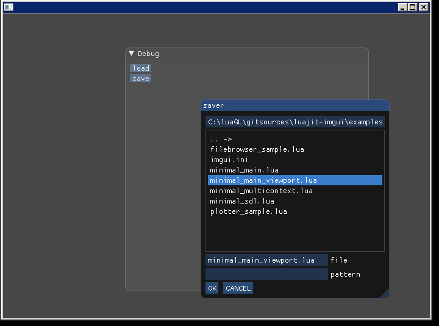

# LuaJIT-ImGui

This is a LuaJIT binding for the excellent C++ intermediate gui [imgui](https://github.com/ocornut/imgui).
Uses cimgui to be the most "up to date" as possible.

Notes:
* currently this wrapper is based on version [1.78 docking of imgui]

# cloning

Remember to do a recursive cloning of the repo to pull submodules also.

    git clone --recurse-submodules https://github.com/sonoro1234/LuaJIT-ImGui.git

If already cloned and updating do from this repo folder:

    git submodule update --init --recursive

# compiling

* linux cimgui_sdl (for love2d for example) needs: <code>sudo apt install libsdl2-dev</code>
* run one of the scripts in the build directory from a sibling folder to the repo. If you want to install,
(recomended) add this <code>-DLUAJIT_BIN="folder where LuaJIT is"</code> to the cmake command. 
* make (or make install).
* If you didnt install in LuaJIT directory, set basedir variable in imgui.lua to the directory libimgui is found.
* Alternatively you can build https://github.com/sonoro1234/anima which includes LuaJIT-ImGui and dependencies.

# trying

* Remember you also need GLFW https://github.com/sonoro1234/LuaJIT-GLFW or SDL2 https://github.com/sonoro1234/LuaJIT-SDL2 .
* You have some scripts on the examples folder.
* New module imgui.window for simplified use. (see window_drag_drop.lua)
* In case you are in a hurry, you can get all done in the releases (GLFW version only).
* Releases are now done in https://github.com/sonoro1234/anima

# binding generation

* if cimgui is updated the binding can be remade with ./lua/build.bat

# used in

* https://github.com/sonoro1234/anima
* can be used for LOVE2D as explained in https://github.com/sonoro1234/LuaJIT-ImGui/issues/20